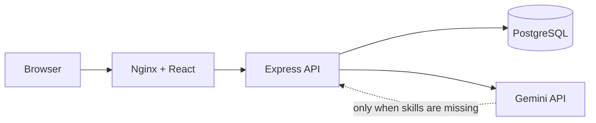

# HTX Task Assignment

A full-stack task-assignment application built with React, Express, PostgreSQL, Prisma, and Gemini.

It supports task creation, nested subtasks, developer assignment based on required skills, task statuses, and automatic skill identification for tasks without selected skills.

## Run with Docker

Requirements:

- [Docker Desktop](https://www.docker.com/products/docker-desktop/)
- A Gemini API key to test automatic skill identification

From the repository root:

```bash
cp backend/.env.example backend/.env
docker compose up --build
```

Open the application at `http://localhost:5173`.

| Service    | Address                   | Purpose                       |
| ---------- | ------------------------- | ----------------------------- |
| Frontend   | `http://localhost:5173` | React single-page application |
| Backend    | `http://localhost:3000` | Express API                   |
| PostgreSQL | `localhost:5432`        | Application database          |

Docker starts PostgreSQL, applies Prisma migrations, seeds the database, builds the frontend, and starts the API.

The seed data includes Alice (Frontend), Bob (Backend), Carol (Frontend and Backend), and Dave (Backend).

### Gemini configuration

Add a Gemini API key to the uncommitted `backend/.env` file:

```text
GEMINI_API_KEY=your_api_key
GEMINI_MODEL=gemini-3.6-flash
```

Do not commit `backend/.env` or expose the key to the frontend.

The application starts without a Gemini key. Tasks with manually selected skills still work, but creating a task without skills returns a clear configuration error.

### Useful Docker commands

```bash
docker compose logs -f backend
docker compose down
```

To also remove local PostgreSQL data:

```bash
docker compose down -v
```

## Local development

Requirements: Node.js, npm, and Docker Desktop.

```bash
npm install
cp backend/.env.example backend/.env
docker compose up -d postgres
```

Start the API and frontend in separate terminals:

```bash
npm run dev:backend
npm run dev:frontend
```

The frontend runs at `http://localhost:5173` and uses `http://localhost:3000` as its default API URL.

## Features and business rules

- A task can require Frontend, Backend, or both skills.
- A task can only be assigned to a developer who has every required skill.
- Tasks can contain nested subtasks.
- A task can only be marked `DONE` when all of its direct subtasks are `DONE`.
- Reopening a subtask also reopens completed parent tasks.
- Required skills are optional when creating a task or subtask.
- When skills are not selected, the backend uses Gemini to identify them from the title.
- User-selected skills are preserved and are not sent to Gemini.

## System design



- **React** displays tasks and provides forms for task creation, nested subtasks, assignment, and status updates.
- **Express routes** validate requests and return JSON responses.
- **Task service** contains the assignment and status business rules.
- **Prisma** provides typed database access, migrations, and seeding.
- **Gemini** identifies skills only when the user has not selected any.
- **Docker Compose** runs the frontend, backend, and PostgreSQL together.

The Gemini integration is behind a small `SkillClassifier` interface. Tests use a fake classifier instead of calling Gemini, so they stay reliable and do not need an API key.

## API

The backend API runs at `http://localhost:3000`.

| Method    | Route               | Description                          |
| --------- | ------------------- | ------------------------------------ |
| `GET`   | `/health`         | Health check                         |
| `GET`   | `/tasks`          | List root tasks and nested subtasks  |
| `POST`  | `/tasks`          | Create a task and nested subtasks    |
| `GET`   | `/tasks/:id`      | Get one task                         |
| `PATCH` | `/tasks/:id`      | Update task assignee and/or status   |
| `GET`   | `/developers`     | List developers and their skills     |
| `GET`   | `/developers/:id` | Get one developer and assigned tasks |
| `GET`   | `/skills`         | List skills                          |
| `GET`   | `/skills/:id`     | Get one skill and related records    |

### Create a task

```json
{
  "title": "Build a responsive homepage",
  "requiredSkillIds": ["frontend-skill-uuid"],
  "subtasks": [
    {
      "title": "Build the navigation component",
      "requiredSkillIds": [],
      "subtasks": []
    }
  ]
}
```

`requiredSkillIds` is optional for every task and subtask. An empty array triggers automatic skill identification on the backend.

### Update a task

```json
{
  "assignedDeveloperId": "developer-uuid",
  "status": "IN_PROGRESS"
}
```

The API returns:

- `400 Bad Request` for invalid input, invalid status changes, missing skills, or incompatible developer assignment.
- `404 Not Found` when a task, developer, or skill does not exist.
- `502 Bad Gateway` when Gemini cannot identify skills.
- `503 Service Unavailable` when Gemini skill identification is not configured.

## Database and Prisma

Validate the schema:

```bash
npm run prisma:validate --workspace backend
```

Create and apply a migration during development:

```bash
npm run prisma:migrate --workspace backend -- --name describe-your-change
```

Open Prisma Studio:

```bash
npm run prisma:studio --workspace backend
```

Run the safe-to-repeat seed manually:

```bash
npm exec --workspace backend -- prisma db seed
```

## Key dependencies

| Dependency                        | Reason                                                                                     |
| --------------------------------- | ------------------------------------------------------------------------------------------ |
| React + Vite                      | Small TypeScript single-page application with fast local development and production builds |
| Express                           | Simple, familiar Node.js HTTP API                                                          |
| Prisma + PostgreSQL               | Typed database access, migrations, and seed support                                        |
| Zod                               | Validates API requests and recursive task payloads before database work                    |
| TanStack Query                    | Fetches API data and refreshes task data after changes                                     |
| Vitest + Supertest                | Tests business rules and API behaviour                                                     |
| React Testing Library             | Tests frontend behaviour without coupling tests to visual styling                          |
| Tailwind CSS                      | Provides a small responsive UI without a component library                                 |
| Docker Compose                    | Runs the frontend, backend, and database consistently                                      |
| Gemini REST API | Calls Gemini's endpoint to run LLM skill classification                                              |
| Helmet and CORS                   | Adds basic security headers and browser access for local development                       |

## Verification

```bash
npm run typecheck --workspace backend
npm test --workspace backend
npm test --workspace frontend
npm run build --workspace frontend
npm run prisma:validate --workspace backend
docker compose up --build
```

The backend tests cover assignment compatibility, status rules, LLM skill identification, Gemini response validation, and error handling. The frontend tests cover task creation, nested subtasks, validation, assignment choices, and submission without selected skills.
